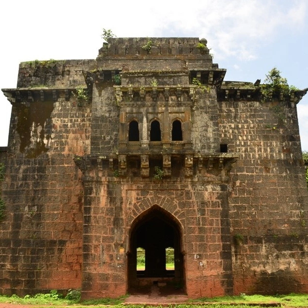
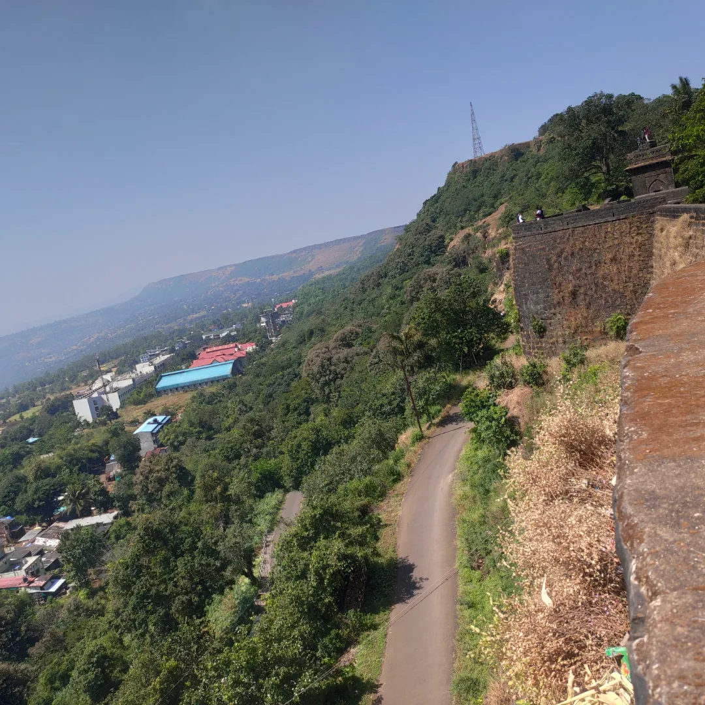
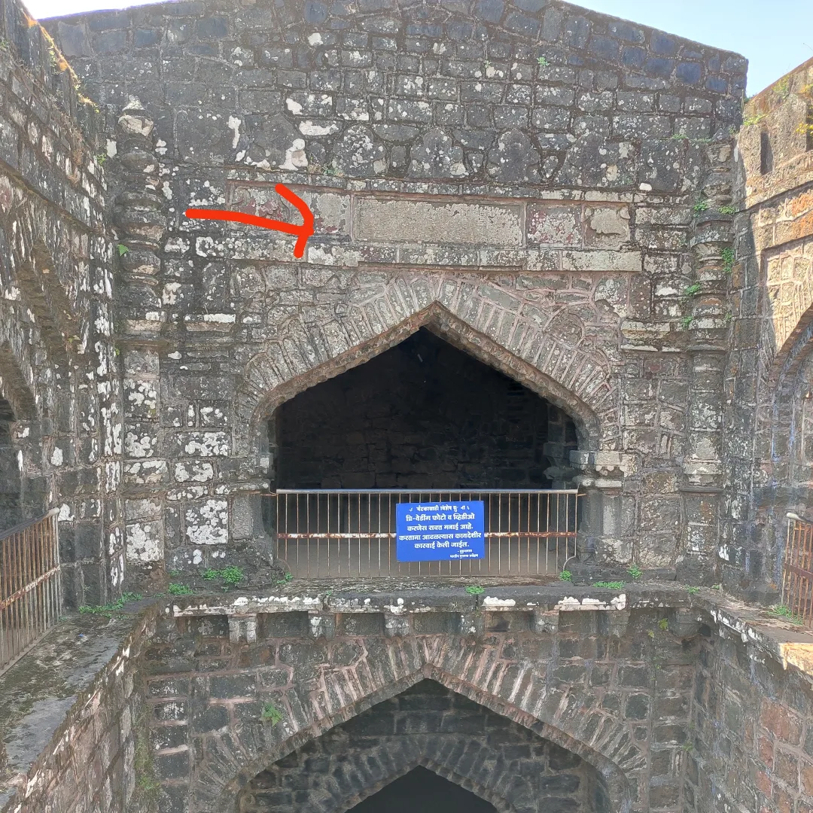

# panhala

	

A hill station,fort and thanks to britishers it is reachable by vehicle.
In 1844 british demolished the TEEN DARWAZA (eastern door) hence making it easily accessible .
This 350 acres of land now houses municipal offices, government schools and housing colonies.

** History / Legend **

Panhalgad saw the tenure of various rulers.

Raja bhoj built this fort around the time 1178–1209 
With  Fortification(तटबंदी) of 8km, 35 burujs it was a strong startegic hold over the route from bijapur to coastal maharashtra. 
He named the fort पन्हगालय as a homage to the Naag community.  

Fort was later won by the Yadavas.

Later on this fort was captured by the adilshah of vijapur/bijapur in 15th century.  Adilshahi dynasty strengthened and heavily fortified the already strong fort.

After the assasination of Afzal Khan in 1659,the Marathas went on a carnage .Capturing 18-20 forts within a fortnight.
(Even today with all the amenities it seems impossible to scale 10 forts in that time period )
Chhatrapati Shivaji Maharaj went to panhala after his heroics at the foothill of Pratapgad.
It was Chhatrapati Shivaji Maharaj who renamed it PANHALGAD!

**SITES**

***ANDHAR BAAV***

HOW to kill enemies without fighting?
The answer was simple,just add poison to the wells and ponds. To avoid this Andhar baav hosts a well at the ground floor and enemies often neglect it as a building.The first floor has a chor darwaza(emergency/secret door).The last floor hosts a room for the soldiers.
Strangely this well is right next to the valley.Yet it has water all year around.

Adil Shah built this well and we can see the urdu script at the centre of the structure.
The urdu script written there roughly translates to ***“Till we have sun and moon,this well won't dry ”***. About 800-900 years from its construction it still has water throughout 12 months .

***TEEN DARWAZA***

	As the name suggests three doors were created to stop the enemies. Siddi Jauhar couldn’t penetrate these massive walls of basalt rock and lead.During the siege of panhalgad this door stood tall against the massive,long range cannons of the Siddhi; The massive hole on the front door is the proof of the event.
	The corridor of teen darwaza has a well “Vishnu Tirth  kund”(विष्णु तीर्थ कुंड)
५ फुट खोल !!
***“कितीही पाणी काढा,पातळी कमी होत नाही,पावसाळ्यात भरत नाही,आणि उन्हाळ्यात अटत नाही!!!***
Sahyadri is full of mysteries and science defying facts,this well confirms it !!!   

***AMBARKHANA(grain storage)***

Three storage buildings namely Ganga,Yamuna,Saraswati for finger millet(नाचणी),Bajra and Rice. 
Storage capacity of each building 
25,000 khandi 
(1 khandi =20 sacks ) 
(25, 000 khandi = 5, 00,00 bags)}
20,00,000 (20 lakh) quintals of rice,finger millet and bajra each !!!
One of the reasons Chhatrapati Shivaji Maharaj survived the siege was because of  this massive food stock.
Yet this much grain was adequate for a single year!!
The average bhakaris consumed by a single mavla was around 10-12 !!!
Eat hard and fight even harder ……..

Sajja Koti
This was the place for meetings and tactics.Shiva Kashid the look alike of Chhatrapati Shivaji Maharaj rehearsed his disguise in this very place.The Maratha subjects of Panhalgad were unable to recognize Shiva Kashid and he would often roam the fort as Maharaj. Hence Siddhi and other commanders were unable to tell the difference.
Chhatrapati Shivaji Maharaj sent his own son Prince Sambhaji to the  mughal camp of Diler Khan.It was a tactic to keep an eye on the mughals;Yet upon returning Prince Sambhaji was charged with treason and under house arrest in Sajja Koti. Sajja Koti hosted the last meeting between both of them.And later on Chhatrapati Shivaji Maharaj was on more.

View from Sajja Koti:
	The hill in the view is pavangad which served as a dummy fort to trick enemies . Part of guerrilla warfare(गनिमी कावा) tactics of Maharaj

Veer  Baji Prabhu Deshpande and Shiva Kashid 
	In 1660,to avenge the previous battle Adilshah sent Siddi Jauhar to lay siege on Panhala and capture Chhatrapati Shivaji Maharaj. With 40,000 troops and a large food supply Siddi comfortably laid siege for over 6 months.Siddi was well aware about the scarcity of food on Panhala.The Marathas were on the verge of defeat ,Chhatrapati Shivaji Maharaj had to act quickly and wisely; “Marathas accepted defeat and Chhatrapati Shivaji Maharaj would thus surrender”,this news was enough to make the siege loose and enemy was unaware.On 12 july 1660 two palanquin were ready .The first  palanquin with Shiva Kashid towards the eastern door to meet siddi jauhar. Second  palanquin for Chhatrapati Shivaji Maharaj.Maharaj was reluctant to sacrifice his own soldier Shiva Kashid .But Shiva Kashid was firm and said proudly 
“ न्हावी म्हणून जगण्या पेक्षा एक दिवस राजा म्हणून मरेल”.
	Shiva Kashid fooled Siddi and thus gave valuable time for Maharaj to escape through the western side.Grabbing this opportunity Shivaji Maharaj with 600 mavalas and Baji Prabhu Deshpande rode towards vishalgad.
Siddi understood the plot and dispatched 10,000 cavalry for the hunt.Shiva Kashid was killed for his bravery; 
	It was impossible to reach vishalgad with these many enemies on the hunt.42 kms from panhala at ghodkhind Baji Prabhu insisted on holding the khind and advised Raje to march towards Vishalgad.Chhatrapati Shivaji Maharaj was adamant ,he said they all should fight there itself and see it to the end.Baji Prabhu said boldly,
“१ बाजी मेला तर लाख बाजी मिळतील ,पण लाखांचा पोशिंदा मिळणार नाय ” .He insisted that Raje should reach Vishalgad and fire three rounds of cannon to assure safety.300 mavals left with Maharaj.The other 300 men fought 10,000 ganim(enemy) and thus made a bloodbath.
Standing tall at 6ft 7inches ,with 15kg  dand pattas in both hands, Baji Prabhu fought until his last breath.These people achieved martyrdom thus making this ghodkhind pavan(holy) with their blood.
	

Kondaji Farzand
In 1673 with mere 60 mavalas  Kondaji Farzand defeated 2500 mughals and took over panhalgad yet again.

Later on Maharani Tarabai took over the kolhapur region of swarajya and appointed panhala as her capital.Thus keeping the flames alive of a brave empire  !!!

Rajdindi Trek 
The Panhalgad to Vishalgad trek is completed by thousands of tourists every year to remember the historic escape of Chhatrapati Shivaji Maharaj .These days it takes around 3 days to complete the trek.Those warriors did that in mere 16 hours !!!
